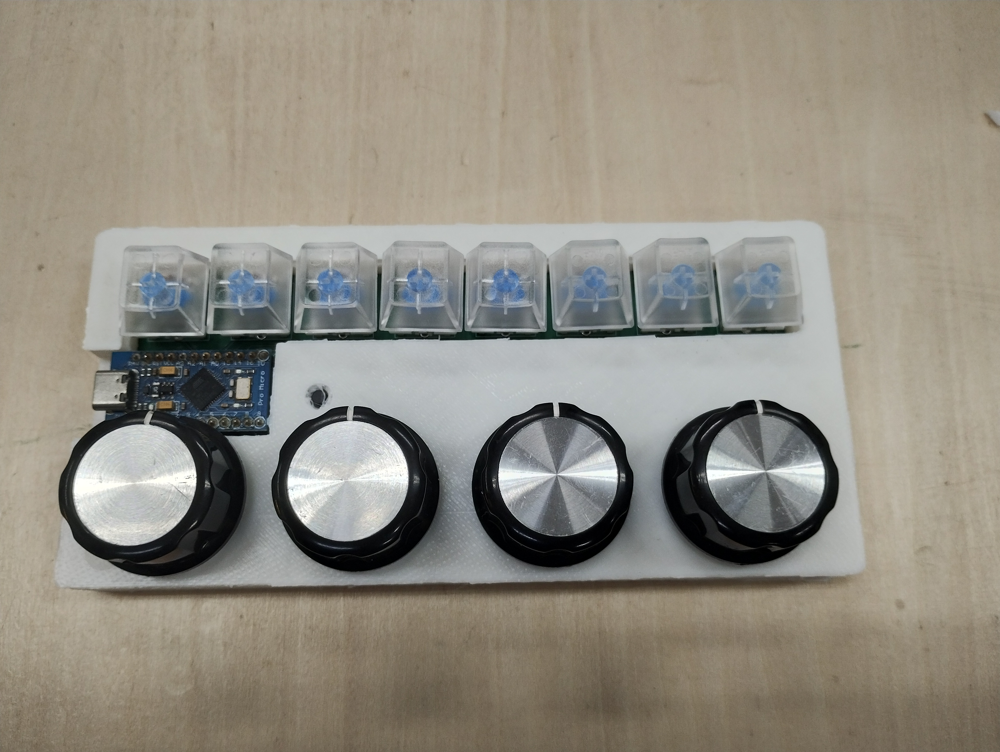

# gejipad_8s4re

自作キーボード「gejipad_8s4re」のハードウェア設計データ(KiCad)を公開するリポジトリです。

> **Note:** このリポジトリにはハードウェア(回路図・基板データ)のみを収録しています。ファームウェアはQMK Firmwareへの統合を申請中(`gejigeji/gejipad_8s4re`)であり、本リポジトリには含まれません。

## 概要



| 項目 | 内容 |
|---|---|
| キー数 | 8キー |
| ロータリーエンコーダ | 4基 |
| レイアウト | キー1列 + ロータリーエンコーダ1列 |
| MCU | ATmega32U4 |
| スイッチ | MX互換 |
| ファームウェア | [QMK Firmware](https://github.com/qmk/qmk_firmware) `gejigeji/gejipad_8s4re` として申請中(本リポジトリには含まれません) |

## リポジトリ構成

```
gejipad_8s4re/
├── gejipad_8s4re.kicad_pro   # KiCadプロジェクトファイル
├── gejipad_8s4re.kicad_sch   # 回路図
├── gejipad_8s4re.kicad_pcb   # 基板データ
├── libs/                     # 自作/追加ライブラリ(シンボル・フットプリント・3Dモデル)
├── production/                # 発注用データ(ガーバー・BOM・部品配置)・ケース
└── docs/                      # 回路図PDF・基板画像など
```

## 開発環境

- KiCad 7.0

## 基板の発注方法

1. `production/gerbers/` 内のガーバーデータをPCB製造業者(JLCPCBなど)にアップロード
2. 部品は `production/gejipad_8s4re-BOM.csv` を参照

## ファームウェアについて

本キーボードのファームウェアは [QMK Firmware](https://github.com/qmk/qmk_firmware) への統合を申請中です(統合先パス: `keyboards/gejigeji/gejipad_8s4re/`)。現時点では未マージのため、ハードウェア(本リポジトリ)とは別管理とし、キーマップ等のファームウェア関連ファイルはこのリポジトリには含めていません。

<!-- PRのURLが判明したら、ここに追記します -->

マージ後はQMK Firmwareの `keyboards/gejigeji/gejipad_8s4re/` に統合される予定です。

## ライセンス

本リポジトリのハードウェア設計データ(回路図・基板データ)は [CC BY-SA 4.0](https://creativecommons.org/licenses/by-sa/4.0/)(Creative Commons Attribution-ShareAlike 4.0 International)のもとで公開しています。改変・再配布・商用利用は自由ですが、クレジット表記(Attribution)と、改変版を同じライセンスで公開すること(ShareAlike)が条件となります。詳細は [LICENSE](./LICENSE) を参照してください。

ファームウェア部分は本リポジトリに含まれないため、このライセンスの対象外です。QMK Firmwareへの統合後は、QMK側のライセンス(GPLv2/v3)に従います。

