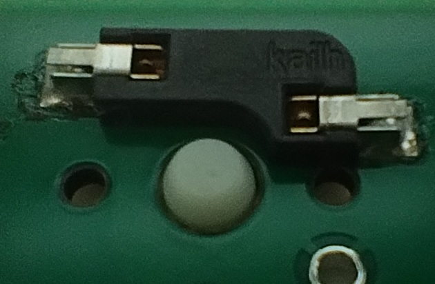
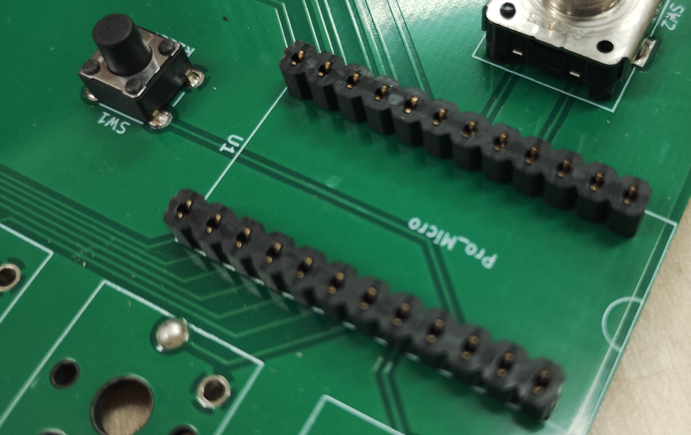
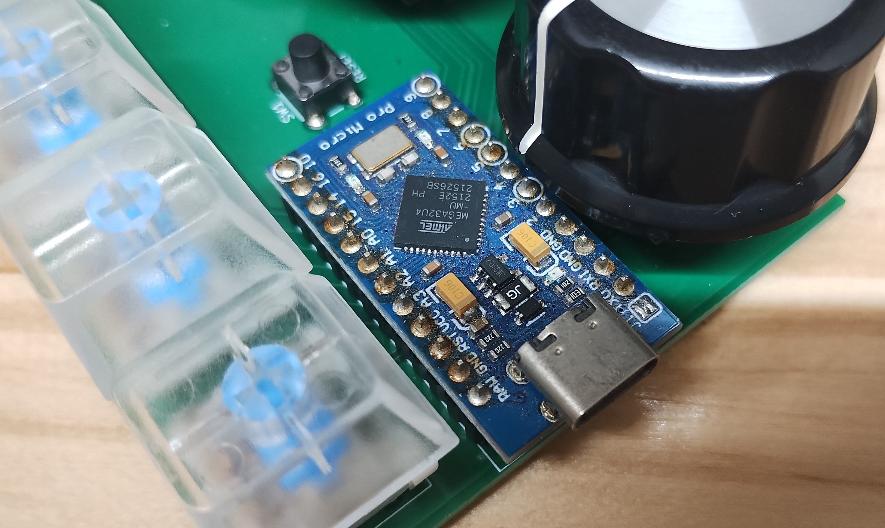

# 組み立てマニュアル

このドキュメントは、本キーボードの組み立て手順をまとめたものです。使用部品は [部品表 (BOM)](../production/gejipad_8s4re-bom.csv) を参照してください。

## 事前準備

- ガーバーファイルを使用してプリント基板を発注する
- STLファイルを3Dプリンターで出力する（ケースを使用する場合。必要に応じて）

## 組み立て手順

### 1. Kailh Switch Socketのはんだ付け（SW6-13）

プリント基板にKailh製のスイッチソケットをはんだ付けします。キースイッチ中央の穴をふさがないよう、取り付け向きに注意してください。

### 2. タクトスイッチのはんだ付け（SW1）

リセット用のタクトスイッチをはんだ付けします。

### 3. ロープロファイルソケット・ピンヘッダーのはんだ付け（U1）

Pro Micro用のソケットとピンヘッダーをはんだ付けします。

傾いた状態ではんだ付けするとPro Microが正しく挿さらなくなるため、プリント基板・ソケット・ピンヘッダー・Pro Microを実際に重ねて位置を合わせた状態ではんだ付けするのがおすすめです。

- プリント基板側にはソケットを、Pro Micro側にはピンヘッダーをはんだ付けする
- ピンヘッダーで直接はんだ付けする方法、コンスルーを使用する方法など、必要に応じて対応可能
- ロータリーエンコーダーのつまみと干渉しないよう、高さに注意すること

### 4. ロータリーエンコーダーのはんだ付け（SW2-5）

### 5. ケースへの組み込み（必要に応じて）

M3のタッピングビスで、蓋と底を固定します。

### 6. ロータリーエンコーダーへのつまみの取り付け

### 7. キースイッチ・キーキャップの取り付け
